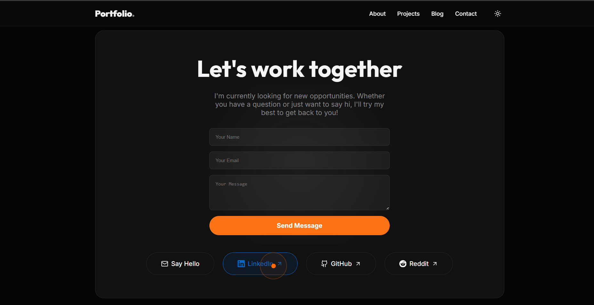
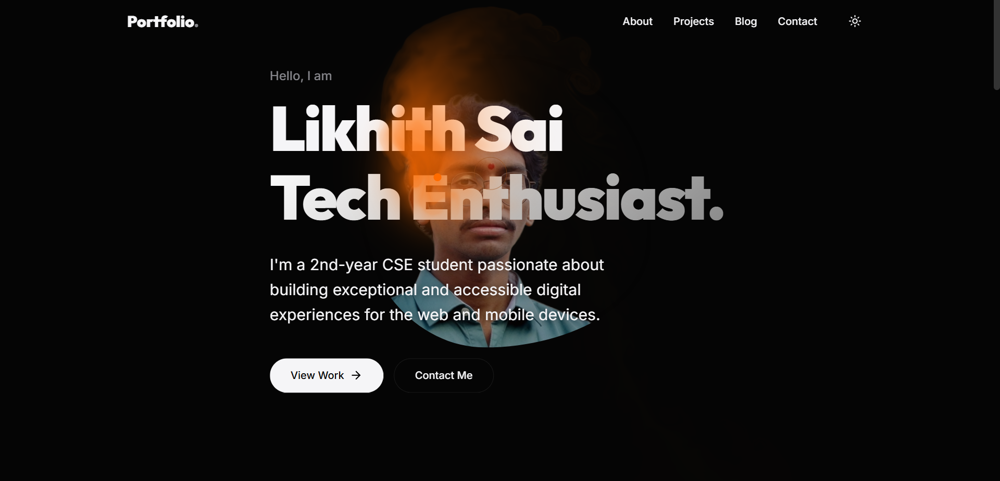
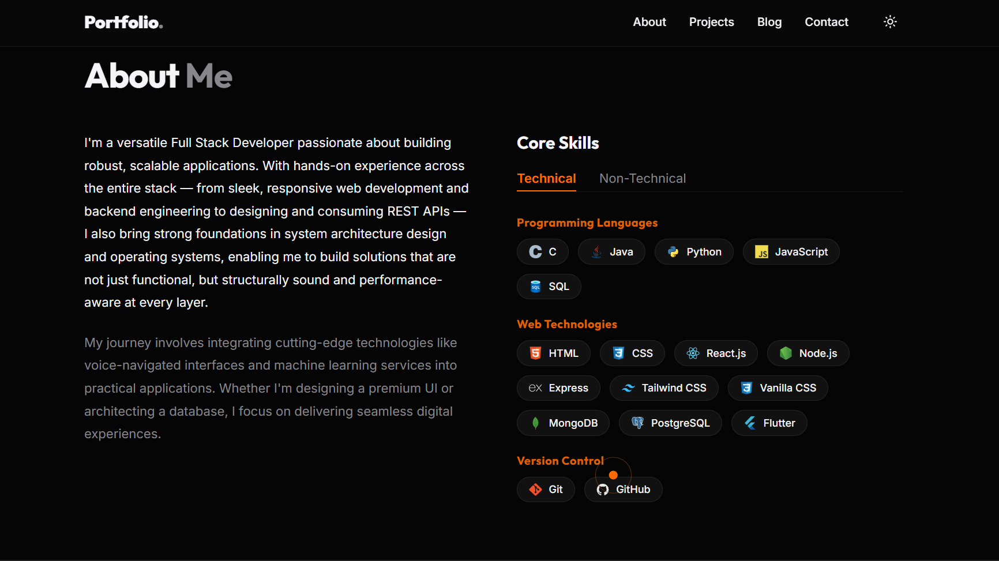

# 🚀 Modern Full-Stack MERN Portfolio

[](https://portfolio-livid-five-ae4egkqhkw.vercel.app/)


A premium, high-performance developer portfolio built with the **MERN** stack (MongoDB, Express, React, Node.js) and powered by **Vite**. Features dynamic 3D tilt interactions, sleek animations, and a fully secured custom admin dashboard for content management.

---

## 📸 Interface Previews

### 1. Hero Landing Experience
A striking, highly-interactive landing area featuring cursor-tracking splash effects and glassmorphism elements to immediately capture attention.


### 2. Live Projects Showcase
A sleek, grid-based gallery displaying full-stack projects dynamically fetched from the MongoDB Atlas database, complete with elegant hover states.


### 3. CMS & Blog Management
A customized content management system integrated directly into the UI. Features an Admin Passcode secured gateway to securely publish and manage articles.


---

## ✨ Features

- **Dynamic 3D UI**: Highly interactive interface using `framer-motion` (3D tilt cards, cursor tracking, splash effects).
- **Dark/Light Mode**: Full responsive theming system.
- **RESTful API**: Complete custom backend utilizing Node.js and Express.
- **Admin Authenticated CMS**: Secure passcode-protected endpoints to Create and Delete blog posts directly from the UI.
- **Live Database**: Data persistent scaling with MongoDB Atlas and Mongoose schemas.
- **Monorepo Architecture**: Cleanly separated `portfolio` (frontend) and `backend` codebases orchestrating seamlessly using `concurrently`.

---

## 🛠️ Tech Stack

**Frontend**
- React 19 (Vite)
- Framer Motion (Animations)
- Vanilla CSS (Glassmorphism & Theming)

**Backend**
- Node.js & Express.js
- MongoDB Atlas & Mongoose
- CORS & dotenv (Security)

---

## 📂 Project Structure

```text
📁 FS_1/
├── 📁 backend/                # Node.js + Express API
│   ├── 📁 models/             # Mongoose Schemas (Blog, Project, Contact)
│   ├── .env                   # Backend environment variables
│   └── server.js              # Express routing and DB connection
│
├── 📁 portfolio/              # React + Vite Frontend
│   ├── 📁 src/
│   │   ├── 📁 components/     # Reusable UI components
│   │   ├── main.jsx           # React mounting
│   │   └── index.css          # Global styles & theme tokens
│   └── .env                   # Frontend environment variables
│
├── package.json               # Root manager (Concurrently)
└── README.md                  # Project documentation
```

---

## 💻 Local Setup Guide

Follow these steps to run the complete full-stack environment on your local machine.

### 1. Prerequisites
Ensure you have the following installed:
- [Node.js](https://nodejs.org/) (v18 or higher recommended)
- [Git](https://git-scm.com/)

### 2. Clone the Repository
```bash
git clone https://github.com/likhithsai007/portfolio.git
cd portfolio
```

### 3. Install Dependencies
Run the install command in the root folder, backend folder, and frontend folder:
```bash
npm install
cd backend && npm install
cd ../portfolio && npm install
cd ..
```

### 4. Configure Environment Variables
You will need to set up two `.env` files.

**Backend (`backend/.env`)**
Create a `.env` file in the `backend/` directory:
```env
PORT=5000
NODE_ENV=development
MONGO_URI=mongodb+srv://<your_username>:<your_password>@cluster0...
ADMIN_SECRET=<your_secure_passcode>
```

**Frontend (`portfolio/.env`)**
Create a `.env` file in the `portfolio/` directory:
```env
VITE_API_URL=http://localhost:5000/api
```

### 5. Start the Application
Return to the root directory (`FS_1/`) and run the master script. This will start the React Frontend and the Node.js Backend simultaneously!
```bash
npm run dev
```
- **Frontend** will be running at `http://localhost:5173`
- **Backend API** will be running at `http://localhost:5000`

---

## 🌐 API Endpoints

| Method | Endpoint | Description | Security |
|--------|----------|-------------|----------|
| GET | `/api/projects` | Fetch all portfolio projects | Public |
| GET | `/api/blogs` | Fetch all blog articles | Public |
| POST | `/api/blogs` | Create a new blog post | Admin Passcode |
| DELETE | `/api/blogs/:id` | Delete a specific blog post | Admin Passcode |
| POST | `/api/contact` | Submit a new contact message | Public |

---

## 🛡️ License

This project is open-source and available under the [MIT License](LICENSE).
